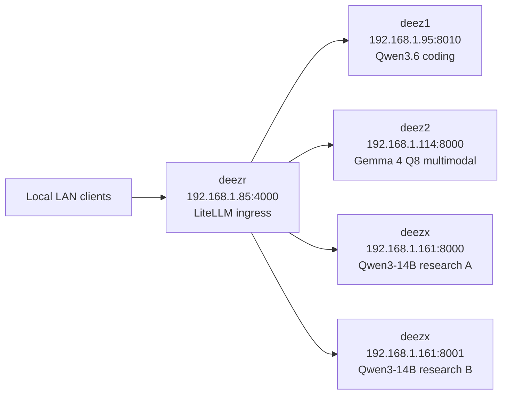

# Local Inference Fabric

This repo is the rebuild source of truth for the four-host local inference lab. Each top-level host directory maps to one remote deployment directory, and the intended recovery flow is simple: restore the host-specific files, make sure the expected model/cache paths exist, start the backend nodes first, then start the LiteLLM router last.

## Deployment Layout

| Host | IP | Remote deploy dir | Source in this repo | Required local state |
| --- | --- | --- | --- | --- |
| `deez1` | `192.168.1.95` | `/opt/deez1` | [deez1/docker-compose.yaml](deez1/docker-compose.yaml), [deez1/tool_chat_template_qwen3coder.jinja](deez1/tool_chat_template_qwen3coder.jinja) | `/root/models/qwen-gguf-strix/Qwen3.6-35B-A3B-Q8_0.gguf` must already exist; the chat-template file must live beside the compose file |
| `deez2` | `192.168.1.114` | `/opt/deez2` | [deez2/docker-compose.yaml](deez2/docker-compose.yaml) | `/root/.cache/huggingface` must be writable; first boot populates the Gemma 4 GGUF and mmproj cache |
| `deezx` | `192.168.1.161` | `/opt/deezx` | [deezx/docker-compose.yaml](deezx/docker-compose.yaml), [deezx/tool_chat_template_qwen3coder.jinja](deezx/tool_chat_template_qwen3coder.jinja) | `/root/models/qwen3-14b-gguf/Qwen_Qwen3-14B-Q8_0.gguf` must already exist; the chat-template file must live beside the compose file |
| `deezr` | `192.168.1.85` | `/opt/deezr` | [deezr/docker-compose.yaml](deezr/docker-compose.yaml), [deezr/config.yaml](deezr/config.yaml) | `config.yaml` must stay next to the compose file |

## Node Summary

| Host | Purpose | Runtime stack | Models / services | Runtime context | Ports | Notes |
| --- | --- | --- | --- | --- | --- | --- |
| `deez1` | Low-latency coding node | `llama.cpp` Vulkan | `Qwen3.6-35B-A3B-Q8_0.gguf` | `262144` | `8010` | Text-only coding path; uses local GGUF file mounted from `/root/models/qwen-gguf-strix` |
| `deez2` | Multimodal thinking / Opus replacement | `llama.cpp` Vulkan | `TrevorJS/gemma-4-26B-A4B-it-uncensored` alias backed by uncensored Gemma 4 `Q8_0` GGUF + mmproj | `262144` | `8000` | Vision enabled, audio disabled, structured `reasoning_content`, native long-context target |
| `deezx` | Fast research / Haiku replacement node | `llama.cpp` CUDA | Two independent `Qwen/Qwen3-14B` Q8 research servers | `32768` on each research lane | `8000`, `8001` | One 3090 per research instance; tool-calling uses the official `Qwen/Qwen3-14B` chat template content mounted from the local template file |
| `deezr` | User-facing ingress / router | LiteLLM | Alias router over all backend services | Not applicable | `4000` | LAN-only, no master key, load-balances `research` across both `deezx` research lanes |

## Service Inventory

| Host | Service | Exposed model id or alias | Backing model / repo | Runtime | Context | Capability |
| --- | --- | --- | --- | --- | --- | --- |
| `deez1` | Coding chat | `Qwen3.6-35B-A3B-Q8_0.gguf` | Local GGUF: `Qwen3.6-35B-A3B-Q8_0.gguf` | `llama.cpp` Vulkan | `262144` | Text chat / coding |
| `deez2` | Thinking chat | `TrevorJS/gemma-4-26B-A4B-it-uncensored` | HF repo `AgentAnon/gemma-4-26B-A4B-it-uncensored-GGUF`, file `gemma-4-26B-A4B-it-uncensored-Q8_0.gguf`, mmproj auto-resolved from same snapshot | `llama.cpp` Vulkan | `262144` | Text chat, image understanding, reasoning |
| `deezx` | Research lane A | `Qwen/Qwen3-14B` | HF repo `bartowski/Qwen_Qwen3-14B-GGUF`, file `Qwen_Qwen3-14B-Q8_0.gguf` | `llama.cpp` CUDA | `32768` | Fast text chat and tool use on GPU 0 |
| `deezx` | Research lane B | `Qwen/Qwen3-14B` | HF repo `bartowski/Qwen_Qwen3-14B-GGUF`, file `Qwen_Qwen3-14B-Q8_0.gguf` | `llama.cpp` CUDA | `32768` | Fast text chat and tool use on GPU 1 |
| `deezr` | LiteLLM ingress | `thinking`, `opus`, `coding`, `coder`, `research`, `haiku` | Router only; forwards to other hosts | LiteLLM | Not applicable | Unified client entrypoint with dual-backend research group |

## Router Aliases

`deezr` is intentionally LAN-only and does not require a master key.

| User-facing alias | Routed to | Effective model id | Purpose |
| --- | --- | --- | --- |
| `thinking` | `deez2:8000` | `TrevorJS/gemma-4-26B-A4B-it-uncensored` | Main multimodal thinking path |
| `opus` | `deez2:8000` | `TrevorJS/gemma-4-26B-A4B-it-uncensored` | Same backend as `thinking`; compatibility alias |
| `coding` | `deez1:8010` | `Qwen3.6-35B-A3B-Q8_0.gguf` | Main coding path |
| `coder` | `deez1:8010` | `Qwen3.6-35B-A3B-Q8_0.gguf` | Same backend as `coding`; compatibility alias |
| `research` | `deezx:8000` and `deezx:8001` | `Qwen/Qwen3-14B` | Load-balanced fast research / tool-use path |
| `haiku` | `deezx:8000` and `deezx:8001` | `Qwen/Qwen3-14B` | Compatibility alias routed to the same fast research group |

## Network Map

## Rebuild Order

1. Prepare host prerequisites: `deez1` and `deez2` need Docker Compose plus working Vulkan access to `/dev/dri`; `deezx` needs Docker Compose plus the NVIDIA container runtime; `deezr` only needs Docker Compose.
2. Restore the deployment directories: put each host bundle into its matching remote directory under `/opt`; both `deez1` and `deezx` must include their chat-template file beside the compose file, and `deezr` must include `config.yaml` beside the compose file.
3. Restore model and cache paths: `deez1` needs the Qwen GGUF in `/root/models/qwen-gguf-strix` before startup, `deezx` needs the Qwen3-14B GGUF in `/root/models/qwen3-14b-gguf`, and `deez2` needs a writable Hugging Face cache directory under `/root/.cache/huggingface`.
4. Start backend nodes first: bring up `deez1`, then `deez2`, then `deezx`; `deez2` is intentionally the slowest first boot because it may need to populate the Gemma 4 snapshot and mmproj cache and then warm the multimodal model.
5. Start `deezr` last: the router should come up only after the backend health checks are already green.
6. Validate the fleet: use [tools/fleet_smoke.sh](tools/fleet_smoke.sh) for the transport-level smoke and [tools/langchain_fleet_smoke.sh](tools/langchain_fleet_smoke.sh) for the SDK-level agent smoke; a healthy rebuild ends with both `FLEET_SMOKE_OK` and `LANGCHAIN_FLEET_SMOKE_OK`.

## Validation Coverage

- [tools/fleet_smoke.sh](tools/fleet_smoke.sh) checks raw backend and routed availability, direct and routed tool calls across both deezx research lanes, multimodal requests, long-window requests, and parallel burst behavior.
- [tools/langchain_fleet_smoke.sh](tools/langchain_fleet_smoke.sh) exercises the same topology through LangChain on Python 3.11, including real agent execution, bound tool calls, multimodal requests, long-window requests, and routed concurrency across both `research` and `haiku`.
- [tools/langchain_fleet_smoke.py](tools/langchain_fleet_smoke.py) validates both direct deezx research endpoints plus routed `research` and `haiku`, with agent-level and bound-tool coverage aimed at fast tool-calling behavior rather than retrieval services.

## Reliability Defaults

- Every service uses Docker Compose with `restart: unless-stopped`.
- Every service enables `init: true` and log rotation to reduce long-run process and disk churn.
- Health checks use the real service ports; this already fixed the old false-unhealthy problem on `deez1`.
- `deez2` uses `q8_0` KV cache tensors and a single slot, which is what makes native `262144` context practical on this hardware.
- `deez2` multimodal startup intentionally has a long health-check grace period because Gemma 4 warmup is expensive.
- `deezx` runs two independent `Qwen3-14B` `Q8_0` research servers, one per 3090, each tuned for `32768` context and low-latency tool use.
- LiteLLM drops unsupported params and retries transient upstream failures twice to reduce client-side noise.

## Rebuild Gotchas

- `deez1` and `deezx` both expect their Qwen GGUF files to already exist at the mounted local paths; neither node self-fetches its main model in this layout.
- `deez2` uses the exposed alias `TrevorJS/gemma-4-26B-A4B-it-uncensored`, but the actual files are pulled from the `AgentAnon` uncensored GGUF repo because that repo includes the matching Q8 weight and mmproj assets.
- Two separate `Qwen3.6-35B-A3B` `Q8_0` instances do not fit one-per-3090 here; the validated replacement path is dual `Qwen3-14B` `Q8_0` at `32768` context, one instance per GPU.
- `deezx` no longer hosts embedding or rerank services in this layout; the node is dedicated to fast research / tool-calling traffic.
- The `tool_chat_template_qwen3coder.jinja` filenames are historical, but the deployed contents now track the official upstream chat template for each served model family: `Qwen3.6-35B-A3B` on `deez1` and `Qwen/Qwen3-14B` on `deezx`.
- `deezr` is the client-facing entrypoint; direct backend ports are still useful for debugging, but normal use should go through `:4000`.
