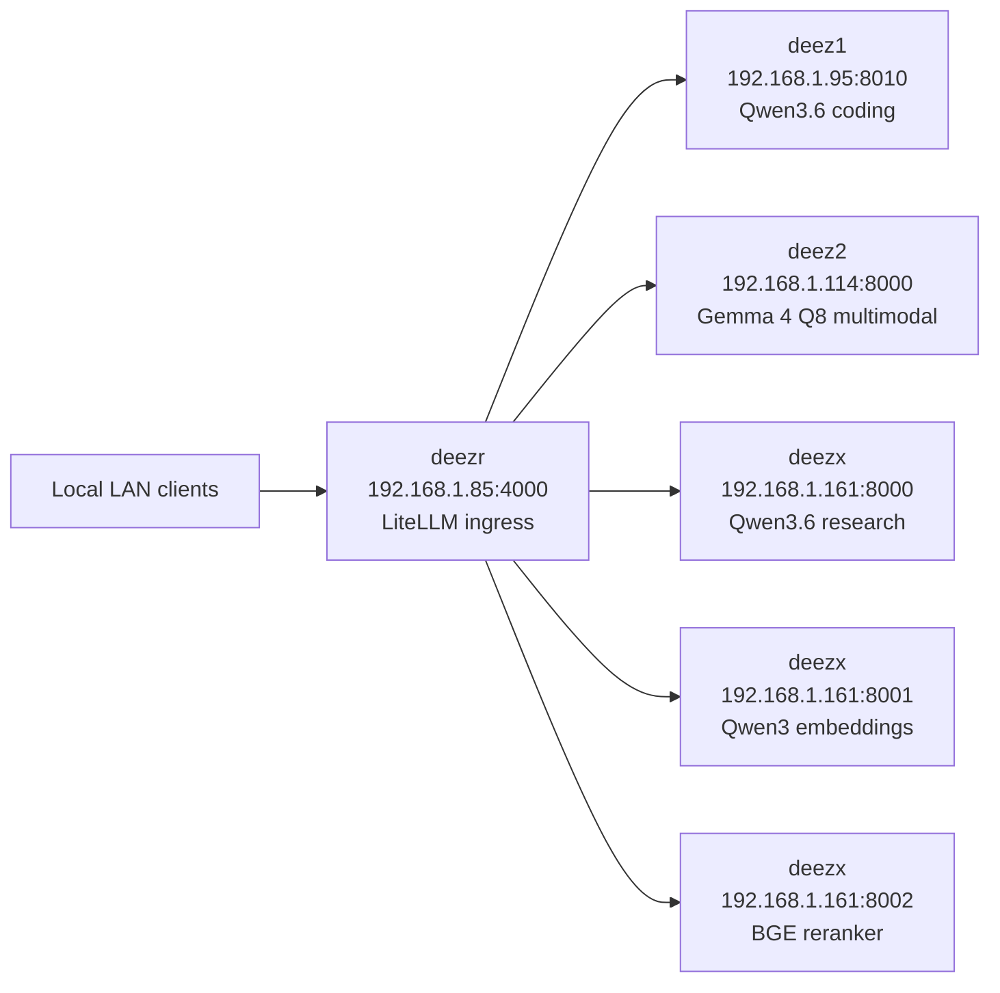

# Local Inference Fabric

This repo is the rebuild source of truth for the four-host local inference lab. Each top-level host directory maps to one remote deployment directory, and the intended recovery flow is simple: restore the host-specific files, make sure the expected model/cache paths exist, start the backend nodes first, then start the LiteLLM router last.

## Deployment Layout

| Host | IP | Remote deploy dir | Source in this repo | Required local state |
| --- | --- | --- | --- | --- |
| `deez1` | `192.168.1.95` | `/opt/deez1` | [deez1/docker-compose.yaml](deez1/docker-compose.yaml) | `/root/models/qwen-gguf-strix/Qwen3.6-35B-A3B-Q8_0.gguf` must already exist |
| `deez2` | `192.168.1.114` | `/opt/deez2` | [deez2/docker-compose.yaml](deez2/docker-compose.yaml) | `/root/.cache/huggingface` must be writable; first boot populates the Gemma 4 GGUF and mmproj cache |
| `deezx` | `192.168.1.161` | `/opt/deezx` | [deezx/docker-compose.yaml](deezx/docker-compose.yaml), [deezx/qwen3_coder_named_safe.py](deezx/qwen3_coder_named_safe.py), [deezx/tool_chat_template_qwen3coder.jinja](deezx/tool_chat_template_qwen3coder.jinja) | `/root/.cache/huggingface` must be writable; the local tool parser and template files must live beside the compose file |
| `deezr` | `192.168.1.85` | `/opt/deezr` | [deezr/docker-compose.yaml](deezr/docker-compose.yaml), [deezr/config.yaml](deezr/config.yaml) | `config.yaml` must stay next to the compose file |

## Node Summary

| Host | Purpose | Runtime stack | Models / services | Runtime context | Ports | Notes |
| --- | --- | --- | --- | --- | --- | --- |
| `deez1` | Low-latency coding node | `llama.cpp` Vulkan | `Qwen3.6-35B-A3B-Q8_0.gguf` | `262144` | `8010` | Text-only coding path; uses local GGUF file mounted from `/root/models/qwen-gguf-strix` |
| `deez2` | Multimodal thinking / Opus replacement | `llama.cpp` Vulkan | `TrevorJS/gemma-4-26B-A4B-it-uncensored` alias backed by uncensored Gemma 4 `Q8_0` GGUF + mmproj | `262144` | `8000` | Vision enabled, audio disabled, structured `reasoning_content`, native long-context target |
| `deezx` | Research + retrieval node | `vLLM` + TEI | Research chat: `Qwen/Qwen3.6-35B-A3B`; embeddings: `Qwen/Qwen3-Embedding-4B`; rerank: `BAAI/bge-reranker-v2-m3` | `4096` on research chat; not applicable on embedding/rerank | `8000`, `8001`, `8002` | GPU 0 is research chat; GPU 1 handles embeddings and rerank; custom parser/template files are required |
| `deezr` | User-facing ingress / router | LiteLLM | Alias router over all backend services | Not applicable | `4000` | LAN-only, no master key, normal client entrypoint |

## Service Inventory

| Host | Service | Exposed model id or alias | Backing model / repo | Runtime | Context | Capability |
| --- | --- | --- | --- | --- | --- | --- |
| `deez1` | Coding chat | `Qwen3.6-35B-A3B-Q8_0.gguf` | Local GGUF: `Qwen3.6-35B-A3B-Q8_0.gguf` | `llama.cpp` Vulkan | `262144` | Text chat / coding |
| `deez2` | Thinking chat | `TrevorJS/gemma-4-26B-A4B-it-uncensored` | HF repo `AgentAnon/gemma-4-26B-A4B-it-uncensored-GGUF`, file `gemma-4-26B-A4B-it-uncensored-Q8_0.gguf`, mmproj auto-resolved from same snapshot | `llama.cpp` Vulkan | `262144` | Text chat, image understanding, reasoning |
| `deezx` | Research chat | `Qwen/Qwen3.6-35B-A3B` | `cyankiwi/Qwen3.6-35B-A3B-AWQ-4bit` | `vLLM` | `4096` | Text chat, tool use |
| `deezx` | Embeddings | `Qwen/Qwen3-Embedding-4B` | `Qwen/Qwen3-Embedding-4B` | TEI | Not applicable | Embeddings |
| `deezx` | Rerank | `BAAI/bge-reranker-v2-m3` | `BAAI/bge-reranker-v2-m3` | TEI | Not applicable | Rerank |
| `deezr` | LiteLLM ingress | `thinking`, `opus`, `coding`, `coder`, `research`, `haiku`, `embedding`, `embed`, `rerank` | Router only; forwards to other hosts | LiteLLM | Not applicable | Unified client entrypoint |

## Router Aliases

`deezr` is intentionally LAN-only and does not require a master key.

| User-facing alias | Routed to | Effective model id | Purpose |
| --- | --- | --- | --- |
| `thinking` | `deez2:8000` | `TrevorJS/gemma-4-26B-A4B-it-uncensored` | Main multimodal thinking path |
| `opus` | `deez2:8000` | `TrevorJS/gemma-4-26B-A4B-it-uncensored` | Same backend as `thinking`; compatibility alias |
| `coding` | `deez1:8010` | `Qwen3.6-35B-A3B-Q8_0.gguf` | Main coding path |
| `coder` | `deez1:8010` | `Qwen3.6-35B-A3B-Q8_0.gguf` | Same backend as `coding`; compatibility alias |
| `research` | `deezx:8000` | `Qwen/Qwen3.6-35B-A3B` | Research / tool-use path |
| `haiku` | `deezx:8000` | `Qwen/Qwen3.6-35B-A3B` | Same backend as `research`; compatibility alias |
| `embedding` | `deezx:8001` | `Qwen/Qwen3-Embedding-4B` | Embeddings |
| `embed` | `deezx:8001` | `Qwen/Qwen3-Embedding-4B` | Same backend as `embedding`; compatibility alias |
| `rerank` | `deezx:8002` | `BAAI/bge-reranker-v2-m3` | Rerank |
| `/tei/rerank` | `deezx:8002/rerank` | Raw TEI endpoint | Direct rerank passthrough |

## Network Map

## Rebuild Order

1. Prepare host prerequisites: `deez1` and `deez2` need Docker Compose plus working Vulkan access to `/dev/dri`; `deezx` needs Docker Compose plus the NVIDIA container runtime; `deezr` only needs Docker Compose.
2. Restore the deployment directories: put each host bundle into its matching remote directory under `/opt`; `deezx` must include the local parser and chat-template files, and `deezr` must include `config.yaml` beside the compose file.
3. Restore model and cache paths: `deez1` needs the Qwen GGUF in `/root/models/qwen-gguf-strix` before startup, while `deez2` and `deezx` need writable Hugging Face cache directories under `/root/.cache/huggingface`.
4. Start backend nodes first: bring up `deez1`, then `deez2`, then `deezx`; `deez2` is intentionally the slowest first boot because it may need to populate the Gemma 4 snapshot and mmproj cache and then warm the multimodal model.
5. Start `deezr` last: the router should come up only after the backend health checks are already green.
6. Validate the fleet: run [tools/fleet_smoke.sh](tools/fleet_smoke.sh) from the repo root; a healthy rebuild should end with `FLEET_SMOKE_OK`.

## Reliability Defaults

- Every service uses Docker Compose with `restart: unless-stopped`.
- Every service enables `init: true` and log rotation to reduce long-run process and disk churn.
- Health checks use the real service ports; this already fixed the old false-unhealthy problem on `deez1`.
- `deez2` uses `q8_0` KV cache tensors and a single slot, which is what makes native `262144` context practical on this hardware.
- `deez2` multimodal startup intentionally has a long health-check grace period because Gemma 4 warmup is expensive.
- `deezx` tool-calling stability depends on the local parser plugin and the vendored Qwen3-Coder XML template being mounted successfully.
- LiteLLM drops unsupported params and retries transient upstream failures twice to reduce client-side noise.

## Rebuild Gotchas

- `deez1` is the only node that does not self-fetch its main model; it expects the Qwen GGUF file to already exist at the mounted local path.
- `deez2` uses the exposed alias `TrevorJS/gemma-4-26B-A4B-it-uncensored`, but the actual files are pulled from the `AgentAnon` uncensored GGUF repo because that repo includes the matching Q8 weight and mmproj assets.
- `deezx` research chat is deliberately short-context at `4096` because it is a tool-use and retrieval path, not the long-context thinking node.
- `deezr` is the client-facing entrypoint; direct backend ports are still useful for debugging, but normal use should go through `:4000`.
