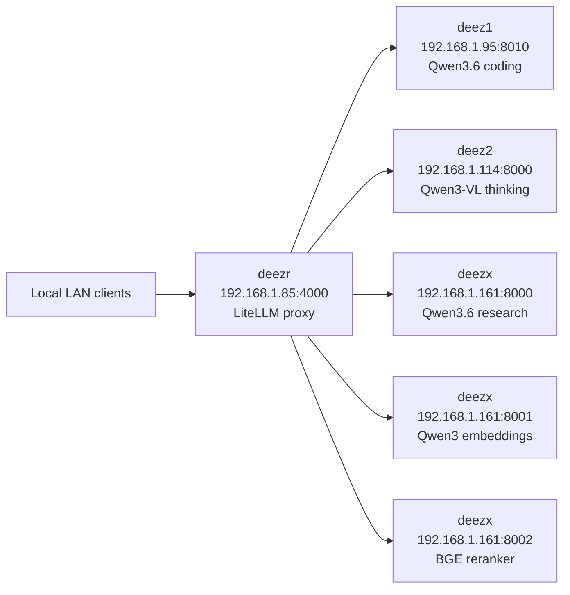

# Local Inference Fabric

This repo tracks the live four-host home-lab inference network. Each host now has a compose-managed deployment bundle for uptime and fast recovery from crashes or OOM exits.

## Fleet Summary

| Host | IP | Role | Compose Bundle | Exposed Services |
| --- | --- | --- | --- | --- |
| `deez1` | `192.168.1.95` | coding | [deez1/docker-compose.yaml](deez1/docker-compose.yaml) | llama.cpp on `:8010` |
| `deez2` | `192.168.1.114` | multimodal thinking | [deez2/docker-compose.yaml](deez2/docker-compose.yaml) | vLLM on `:8000` |
| `deezx` | `192.168.1.161` | research + retrieval | [deezx/docker-compose.yaml](deezx/docker-compose.yaml) | vLLM on `:8000`, embeddings on `:8001`, rerank on `:8002` |
| `deezr` | `192.168.1.85` | LiteLLM LAN router | [deezr/docker-compose.yaml](deezr/docker-compose.yaml) + [deezr/config.yaml](deezr/config.yaml) | LiteLLM proxy on `:4000` |

## Network Map

## Router Contract

`deezr` is LAN-only and does not require a master key.

Model routing exposed by LiteLLM:

- `thinking` and `opus` -> deez2 multimodal vLLM
- `coding` and `coder` -> deez1 llama.cpp
- `research` and `haiku` -> deezx research vLLM
- `embedding` and `embed` -> deezx TEI embeddings
- `rerank` -> deezx TEI reranker
- `/tei/rerank` -> raw rerank pass-through to deezx

## Reliability Defaults

- Every service is now defined in Docker Compose with `restart: unless-stopped`.
- Healthchecks use the correct live ports, which fixes the old false-unhealthy status on `deez1`.
- `init: true` and log rotation are enabled to reduce process and disk churn during long runs.
- The LiteLLM proxy retries transient upstream failures twice and drops unsupported params instead of failing noisy local clients.
- The `deezx` research path remains the tool-capable route; `deezr` forwards that capability through the `research` and `haiku` model groups.

## Host Notes

- `deez1` is the lowest-latency coding path and is tuned for a single local coding workload.
- `deez2` is the multimodal/thinking path and still relies on the earlier AMD grub and firmware fix (`amdgpu.cwsr_enable=0` plus updated MES firmware).
- `deezx` is split by GPU: GPU 0 serves research chat, GPU 1 serves embeddings and rerank.
- `deezr` is the stable ingress point for normal use; the direct host ports remain available for debugging.