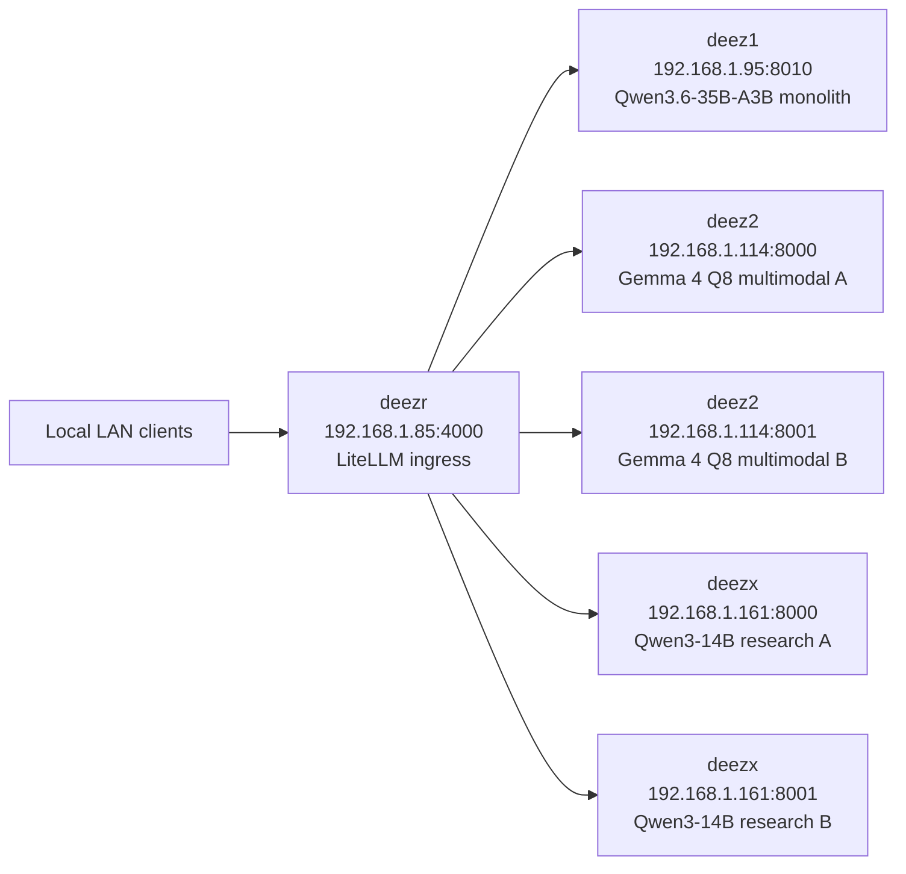

# Local Inference Fabric

This repo is the rebuild source of truth for the four-host local inference lab. The currently validated layout is one shared-weight Qwen 3.6 coding monolith on `deez1`, two Gemma multimodal containers on `deez2` with two slots each, two Qwen3-14B research lanes on `deezx`, and a LiteLLM router on `deezr`.

## Deployment Layout

| Host | IP | Remote deploy dir | Source in this repo | Required local state |
| --- | --- | --- | --- | --- |
| `deez1` | `192.168.1.95` | `/opt/deez1` | [deez1/docker-compose.yaml](deez1/docker-compose.yaml), [deez1/tool_chat_template_qwen3coder.jinja](deez1/tool_chat_template_qwen3coder.jinja) | `/root/models/qwen-gguf-strix/Qwen3.6-35B-A3B-Q8_0.gguf` must already exist |
| `deez2` | `192.168.1.114` | `/opt/deez2` | [deez2/docker-compose.yaml](deez2/docker-compose.yaml) | `/root/.cache/huggingface` must be writable so the Gemma GGUF and mmproj cache can be reused |
| `deezx` | `192.168.1.161` | `/opt/deezx` | [deezx/docker-compose.yaml](deezx/docker-compose.yaml), [deezx/tool_chat_template_qwen3coder.jinja](deezx/tool_chat_template_qwen3coder.jinja) | `/root/models/qwen3-14b-gguf/Qwen_Qwen3-14B-Q8_0.gguf` must already exist |
| `deezr` | `192.168.1.85` | `/opt/deezr` | [deezr/docker-compose.yaml](deezr/docker-compose.yaml), [deezr/config.yaml](deezr/config.yaml) | `config.yaml` must stay beside the compose file |

## Current Topology

| Host | Purpose | Runtime stack | Live model or alias | Ports | Context | Notes |
| --- | --- | --- | --- | --- | --- | --- |
| `deez1` | Coding | `llama.cpp` Vulkan | `Qwen/Qwen3.6-35B-A3B` | `8010` | `262144` total model context | Single monolith with `--parallel 4 --kv-unified`; raw `/slots` reports four slots and each reports `n_ctx = 262144` |
| `deez2` | Multimodal thinking | `llama.cpp` Vulkan | `TrevorJS/gemma-4-26B-A4B-it-uncensored` | `8000`, `8001` | `262144` per container | Two Gemma containers, each started with `--parallel 2 --kv-unified`; total of four live Gemma slots across the host |
| `deezx` | Research | `llama.cpp` CUDA | `Qwen/Qwen3-14B` | `8000`, `8001` | `32768` per container | One Qwen3-14B Q8 server per GPU for fast tool-calling and short-window research work |
| `deezr` | Router | LiteLLM | `thinking`, `coding`, `research` plus aliases | `4000` | Not applicable | `drop_params: true`, `request_timeout: 300`, `num_retries: 2`, admin UI disabled |

## Router Aliases

`deezr` is intentionally LAN-only and does not require a master key.

| User-facing alias | Routed to | Effective model id | Purpose |
| --- | --- | --- | --- |
| `thinking` | `deez2:8000`, `deez2:8001` | `TrevorJS/gemma-4-26B-A4B-it-uncensored` | Load-balanced multimodal thinking path |
| `opus` | `thinking` | `TrevorJS/gemma-4-26B-A4B-it-uncensored` | Compatibility alias |
| `coding` | `deez1:8010` | `Qwen/Qwen3.6-35B-A3B` | Single-backend coding path backed by the monolith |
| `coder` | `coding` | `Qwen/Qwen3.6-35B-A3B` | Compatibility alias |
| `research` | `deezx:8000`, `deezx:8001` | `Qwen/Qwen3-14B` | Load-balanced research path |
| `haiku` | `research` | `Qwen/Qwen3-14B` | Compatibility alias |

## Network Map



## Live Validation

The current layout was validated live with both transport-level and SDK-level smoke suites after redeploy.

- [tools/fleet_smoke.sh](tools/fleet_smoke.sh) passed with `FLEET_SMOKE_OK`.
- [tools/langchain_fleet_smoke.py](tools/langchain_fleet_smoke.py) passed with `LANGCHAIN_FLEET_SMOKE_OK` under Python 3.11.
- Direct deez1 chat and tool calls succeeded.
- Direct and routed parallel bursts succeeded.
- Direct and routed multimodal Gemma checks succeeded.
- Direct deez2 long-window check succeeded.

## Rebuild Order

1. Prepare host prerequisites: `deez1` and `deez2` need Docker Compose plus working Vulkan access to `/dev/dri`; `deezx` needs Docker Compose plus the NVIDIA container runtime; `deezr` only needs Docker Compose.
2. Restore the deployment directories under `/opt` from the matching repo subdirectories.
3. Restore model and cache paths before startup: `deez1` needs the Qwen3.6 GGUF in `/root/models/qwen-gguf-strix`, `deezx` needs the Qwen3-14B GGUF in `/root/models/qwen3-14b-gguf`, and `deez2` needs a reusable Hugging Face cache under `/root/.cache/huggingface`.
4. Start backend nodes first: `deez1`, `deez2`, then `deezx`.
5. Start `deezr` last, and use `docker compose up -d --force-recreate litellm-proxy` after any router config change so LiteLLM actually reloads the model map.
6. Validate the fleet with the commands below.

## Validation Commands

```bash
bash tools/fleet_smoke.sh
.venv-langchain-smoke311/bin/python tools/langchain_fleet_smoke.py
```

Healthy output ends with both `FLEET_SMOKE_OK` and `LANGCHAIN_FLEET_SMOKE_OK`.

## Reliability Notes

- All llama.cpp backends set `--sleep-idle-seconds 3600` to avoid short idle unloads.
- `deez1` keeps one Qwen3.6 Q8 monolith resident and exposes concurrency through slots instead of trying to fit multiple separate 35B processes.
- `deez2` keeps two separate Gemma Q8 containers resident and exposes concurrency through `--parallel 2` on each container.
- Live `rocm-smi` on `deez2` showed about `91%` VRAM allocated after the two-slot-per-container rollout, so the Gemma host has little spare headroom left.
- Direct Qwen requests are most stable when callers pass `chat_template_kwargs.enable_thinking = false` unless reasoning output is explicitly needed.
- For direct Qwen tool-call forcing, string `tool_choice: "required"` avoids the warning emitted by this llama.cpp build for object-style `tool_choice` payloads.
- LiteLLM still serves the SPA shell at `/ui`, but `/.well-known/litellm-ui-config` reports `admin_ui_disabled: true`.

## Rebuild Gotchas

- `deez1` no longer runs the old dual `Qwen2.5-Coder-14B-Instruct` layout. The validated coding topology is one `Qwen/Qwen3.6-35B-A3B` monolith on port `8010`.
- Two separate `Qwen3.6-35B-A3B` Q8 processes do not fit cleanly on the deez1 hardware envelope. Shared-weight slot concurrency is the working solution.
- The `tool_chat_template_qwen3coder.jinja` filename on `deez1` is historical. The active content is the custom Qwen3.6 template that merges consecutive leading system messages so OpenCode and similar clients do not trip the upstream single-system restriction.
- `deez2` exposes the alias `TrevorJS/gemma-4-26B-A4B-it-uncensored`, but the actual GGUF and mmproj assets are pulled from `AgentAnon/gemma-4-26B-A4B-it-uncensored-GGUF`.
- `deezx` is still the fast short-window research node. Long prompts that need more than `32768` context should route to `thinking`, not `research` or `haiku`.
- The llama.cpp `/slots` endpoint currently reports full `n_ctx` values on the slot objects even when `--parallel` is greater than one, so do not treat `/slots` alone as the final word on effective concurrency behavior. Use the smoke suites.
